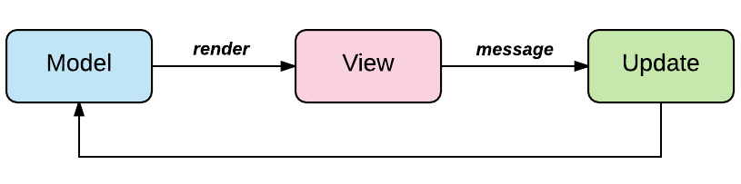

# Elma
## Experimenting with TEA for an Android using Kotlin and Litho

### TEA - The Elm Architecture. Elm is a functional programing language wich is compiled to JavaScript. And TEA is a nice approach for creating single page web-applications using elm language and runtime. For more information about original TEA go to official [guids](https://guide.elm-lang.org/architecture/).

### Sometimes TEA is called MVU (Model-View-Update) - one more variant of MV* architecture but slightly different from commonly used MVC and MVP.

### Picture above describes all the application cycle. And here we see all three main components of the application: *model*, *view*, *update*.
## Model
### It's a simple record (or data class in Kotlin) which represents the state of the application. There are two key traits of a model type: it's immutable, it doesn't have any behaviour. On the other words it is simple immutable container for the state.

## View
### It's a function which takes model and dispatcher as input and returns UI element. Disptacher is required for sending messages into the application loop, usually it has signature **(Msg)->Unit**. In Elm the result of this function has type **Html**, but it is not neccessary. The main purpose of this function is rendering *model* on the UI.

## Update
### It's a function which takes message and model and returns new model. The main purpose of this function is updateting the state. And the best part it is that it's pure. This means that it produces the same output for the same input and has no side-effetcs. Why it's important? Because it is easy to maintain and to test.

## Firstly, **Elma** is simple program loop (Modle-View-Update). Secondly, it uses great UI engine [Litho](https://fblitho.com/) by Facebook.

## Work is still in progress. More details are coming soon.